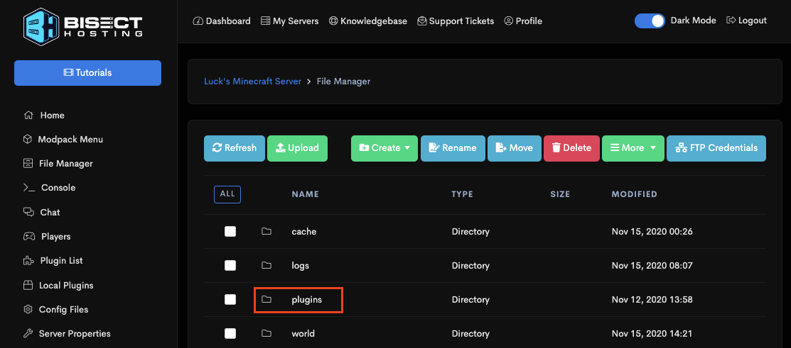
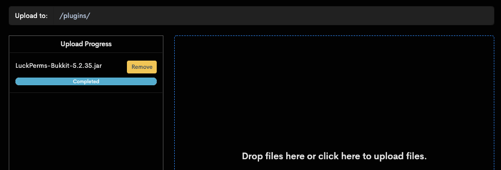
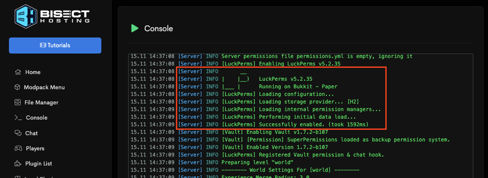
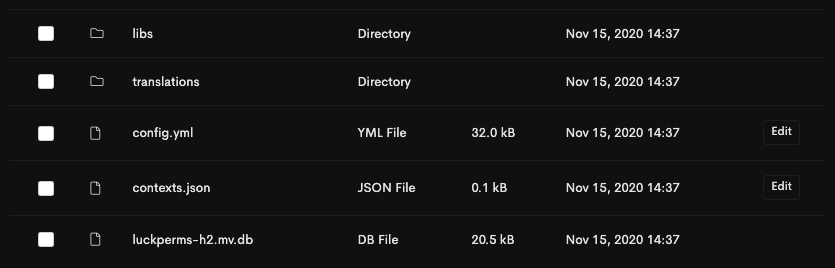
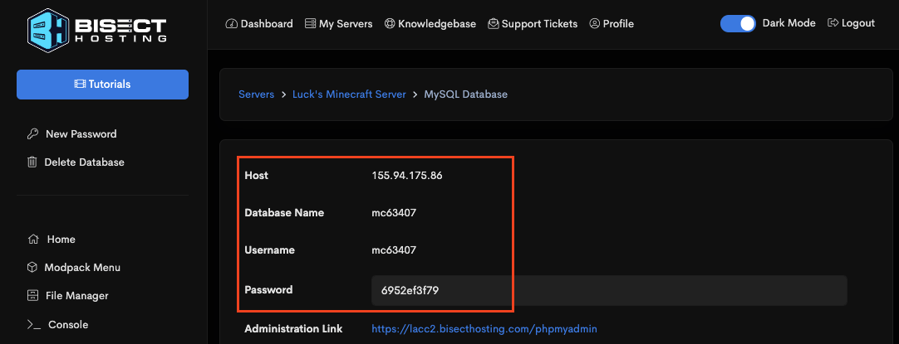
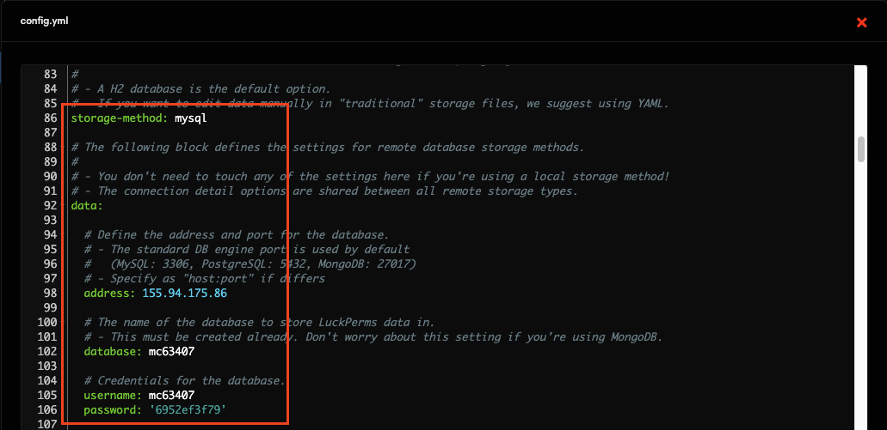
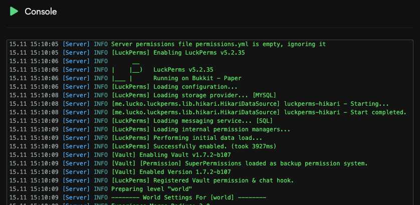

## Initial Setup

#### Step 1: Download the LuckPerms jar file

The first thing you will need to do is download LuckPerms. You can always find the latest versions of LuckPerms for all of the platforms we support on our [downloads page](https://luckperms.net/download).

Just click the link to download and save the file somewhere easily accessible.

* If you are running a _non-modded_ server for Minecraft: Java Edition, we recommend that you use [Paper](https://papermc.io/) as your server.
* If you are running a _Forge "modded"_ server for Minecraft: Java Edition, we recommend that you use [SpongeForge](https://www.spongepowered.org/) as your server.
* If you are running a server for Minecraft: Bedrock Edition, we recommend that you use [NukkitX](https://cloudburstmc.org/) as your server.
* If you are running a proxy to connect multiple Minecraft servers together, we recommend that you use [Waterfall](https://papermc.io/downloads#Waterfall) (BungeeCord) or [Velocity](https://velocitypowered.com/) as your proxy.

If you haven't got anywhere to host your server yet, check out our partner [BisectHosting](https://bisecthosting.com/luck), who are offering LuckPerms users 25% off all of their Minecraft server hosting plans.

#### Step 2: Add the LuckPerms jar to your server's `plugins` or `mods` folder

Next, we need to install LuckPerms onto the server. Make sure you have selected & installed the correct server jar, and that your server has successfully started at least once (this is to ensure the necessary folders will have been generated).

Navigate to your hosting panel's "File Manager", and open the `plugins` folder (for Bukkit, Nukkit, etc) or `mods` folder (for Sponge or Fabric).

Note in step 1 that while Sponge can use 'plugins', these are not the same as Bukkit plugins. The Sponge version of LuckPerms and the Bukkit version are different JARs because they are not cross-compatible. Ensure you install the correct version!

Once you're in the plugins or mods folder, click upload and select the LuckPerms jar you downloaded in Step 1.

If you've installed an older version of LuckPerms before, make sure to delete any existing jar files.

#### Step 3: Fully restart your server

Go to your server console and click "restart" or type `stop`.

This allows LuckPerms to enable and generate the default configuration file.

As your server restarts, you can monitor the console to make sure LuckPerms starts up and enables correctly.

LuckPerms is now installed and you can start using it right away! Move onto the Usage section of the wiki for more information about what to do next!

#### Step 4: Configuring LuckPerms

To customize LuckPerms, you can make changes to its configuration file.

Go back to the "File Manager", then open the `plugins` folder (for Bukkit, Nukkit, etc) or `config` folder (for Sponge or Fabric). Then, open the `LuckPerms` folder within.

Here you will find a number of files. The important ones are:

* `config.yml` - this is the LuckPerms configuration file for Bukkit, Spigot, Nukkit, etc. servers
* `luckperms.conf` - this is the LuckPerms configuration file for Sponge and Fabric servers
* `luckperms-h2.mv.db` - this is the database file LuckPerms uses to store your permissions data (don't delete it!)

You can click the "edit" button next to `config.yml` or `luckperms.conf` to open an editor in your browser. It's also possible to edit these files via FTP.

#### Step 5 (optional): Setup LuckPerms to use a MySQL database or .yml files to store data

By default, LuckPerms stores all of it's data in a file-based database file called "H2". This is great because it's efficient and lets people start using LuckPerms without any extra config steps.

However, if you would prefer for LuckPerms data to be stored in **readable, editable .yml files**: open `config.yml`/`luckperms.conf`, scroll down to the "Storage Settings" section and set `storage-method` to `yaml`. Then restart your server.

If you run multiple servers in a network (or plan to do so in the future), then you will need to setup a remote database like **MySQL** for LuckPerms to store its data in.

Most server hosts provide these for free! Click the option for "MySQL Database", then "Create database". You should be presented with 4 things: a hostname, database name, username and password.

Once you have these details, take a note of them (or duplicate your tab), then navigate back to the LuckPerms `config.yml`/`luckperms.conf` file in the File Manager, and click "edit".

Scroll down to "Storage Settings" and set `storage-method` to `mysql`. Then fill out your database info under the `data:` section.

Click save on the file, then restart your server.

You can then confirm in the console that MySQL has been setup correctly. If you see `Loading storage provider... [MYSQL]` followed by no errors, everything is working correctly!

Remember, you'll need to complete these steps for all servers you have in your network.

## FAQ
### Where do I install LuckPerms?
* If you run a network of servers, you should install LuckPerms into the plugin folder of every server you want to use LuckPerms on.
* If you also want to use LuckPerms to apply permissions on your BungeeCord proxy, you should place LuckPerms-Bungee.jar into your BungeeCord plugins folder.
* If you choose to only install LuckPerms on your proxy, it will have no impact on any permission checks performed by plugins on any backend Bukkit/Sponge servers. If you want that functionality, you need to install LuckPerms on those servers too.

### Can I just install LuckPerms on BungeeCord?
* The permissions system used on BungeeCord is completely separate from the systems used on the backend Spigot/Sponge server.
* If you want the permission checks performed by Bukkit/Sponge plugins to be handled by LuckPerms, install LuckPerms on your Bukkit/Sponge server.
* If you want the permission checks performed by BungeeCord plugins to be handled by LuckPerms, install the BungeeCord variant of LuckPerms on your proxy.
* You **can** just install it on the proxy, but any permission checks which are performed by Bukkit/Sponge plugins will not be handled by LuckPerms.

## Requirements
LuckPerms has a few requirements. The *vast* majority of servers will meet these requirements already.

* You need Java 8 or higher
* Your server needs access to the internet the first time you load LuckPerms

---
### Java 8
Your server must be running **Java 8** or higher. LuckPerms does not work on older versions of Java.

---
### Internet Connection
LuckPerms uses a number of [external libraries](External-connections), some of which are [downloaded automatically at runtime](External-connections#downloading-libraries).

If your server does not have an internet connection, you can install LP locally (where you do have an internet connection), and then copy the content of the `/LuckPerms/libs/` directory to your other server.

## Compatibility
Some known compatibility issues are outlined below. In all cases, these issues are out of our control - and there's nothing we can do to resolve them in LuckPerms itself. 🙁

Some of the compatibility issues are resolved in newer releases of the server - but the fixes are not backdated.

### Other permission plugins
For LuckPerms to fully work & handle all permission checks, it must be the only permission plugin installed on your server (unless you want to perform automatic migration)!

We notice that people often to forget to remove the following permission plugins when they install LuckPerms:
* PowerRanks
* PermissionsEx
* UltraPermissions

---
### CraftBukkit and Offline Mode
If your server is running CraftBukkit and configured in offline (cracked) mode, LuckPerms (and a number of other plugins, for that matter) will not work. This is due to a [CraftBukkit bug regarding the AsyncPlayerPreLoginEvent](https://hub.spigotmc.org/jira/browse/SPIGOT-3541).

This issue is yet to be resolved. (as of writing on 11th Jan 18) There is nothing we can do about it.

Your options are:

1. Use Spigot or [Paper](https://papermc.io/) instead of plain CraftBukkit
2. Enable online mode

---
### Older Minecraft versions
The main release of LuckPerms is not compatible with Minecraft: Java Edition versions earlier than 1.8.8.

A Bukkit LuckPerms release for 1.7.10 can be found on our [downloads page](https://luckperms.net/download/).

---
### Cauldron, Thermos, etc
If you're using Cauldron, Thermos or any other Bukkit-Forge hack, you may encounter errors when trying to load LuckPerms. This is **not** a LuckPerms issue - but rather due to a bug in the server.

These issues have been reported to the respective projects, however none are currently being maintained, so this issue will (most likely) never be fixed. In the meantime, you can hack around these problems using the steps outlined below.

(We offer absolutely **no support** for these fixes.)

1. Navigate to the `libraries/net/md-5/SpecialSource/1.7-SNAPSHOT` directory
2. Delete the `SpecialSource-1.7-SNAPSHOT.jar` file
3. Download SpecialSource v1.7.4 from `https://repo1.maven.org/maven2/net/md-5/SpecialSource/1.7.4/SpecialSource-1.7.4.jar`
4. Copy the jar file to the `libraries/net/md-5/SpecialSource/1.7-SNAPSHOT` directory
5. Rename the jar file you just copied to `SpecialSource-1.7-SNAPSHOT.jar`
6. Start up server. If it stops immediately, you have renamed the SpecialSource wrong.

---
### Essentials
If you're using the "Essentials" bukkit plugin on your server, you may have to perform some extra steps to get it to play nicely with LuckPerms.

#### If you want Essentials to read prefix, suffix & group data from LuckPerms...
You will need to update to **EssentialsX** - an updated version of the original Essentials plugin. The original maintainer of Essentials stopped working on the project in 2014 & recommends EssentialsX as a replacement.

EssentialsX can be found [here](https://essentialsx.net/).

If you want to use LuckPerms prefix/suffix data within Essentials, you also need to install [Vault](https://www.spigotmc.org/resources/vault.34315/).

#### If you don't want Essentials to read prefix, suffix & group data from LuckPerms, but still want LuckPerms to handle permission checks from Essentials...
You either need to update to EssentialsX (as detailed above) or...

Delete the `player-commands` section of the Essentials config.

When Essentials cannot detect a "known" permission system (it doesn't recognise LuckPerms!) - it falls back to it's [own config based permission system](https://github.com/essentials/Essentials/blob/2.x/Essentials/src/config.yml#L137-L142) for Essentials commands.
