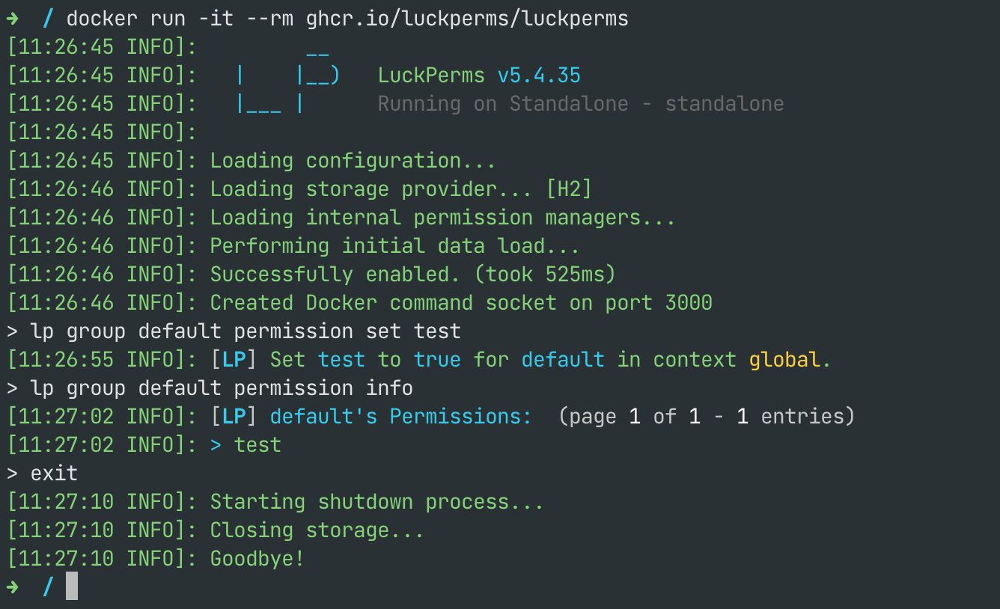

As well as running as a plugin or mod within a Minecraft server, LuckPerms can also be ran as a standalone app. This has two main (current) purposes:

1. To enable server admins to quickly spin up a **LuckPerms CLI** and run commands against a remote database, without needing to start a Minecraft server too!
2. To enable small, standalone extensions (like the **REST API**) to run as a separate app.

## LuckPerms as a Standalone App

The standalone "plugin" is part of the main LuckPerms codebase, within a module called [`standalone`](https://github.com/LuckPerms/LuckPerms/tree/master/standalone).

The easiest (and recommended) way to run the standalone app is using Docker.

You just need to ensure Docker is installed on your machine, and run the following command!

```
docker run -it --rm ghcr.io/luckperms/luckperms
```

This will give you a CLI that you can use just like you would a Minecraft server.

<p>
  
</p>

You can configure your database host/user/password using [environment variables](Configuration#environment-variables).

You can also use Docker Compose. Create a file called `docker-compose.yml`:

```yml
version: "3.8"
services:
  luckperms:
    image: ghcr.io/luckperms/luckperms
    # Uncomment if your database is running on the same host
    #extra_hosts:
    #  - "database:host-gateway"
    environment:
      LUCKPERMS_STORAGE_METHOD: mysql
      LUCKPERMS_DATA_ADDRESS: database:3306
      LUCKPERMS_DATA_DATABASE: minecraft
      LUCKPERMS_DATA_USERNAME: root
      LUCKPERMS_DATA_PASSWORD: passw0rd
```

* Start the app using: `docker compose up -d`. 
* View the console using: `docker compose logs -f luckperms`
* Send a command using: `docker compose exec luckperms send <command>`
* Stop the app using: `docker compose down`

## LuckPerms REST API (for developers)

The LuckPerms REST API is an "extension" that can run within the standalone app (described above).

It allows other programs, applications or scripts to easily read/modify/write LuckPerms data, without needing to interact with the database directly.

For more information, and instructions for how to use the API, please see:
* The [LuckPerms/rest-api](https://github.com/LuckPerms/rest-api) GitHub repository & readme
* The [API Specification](https://petstore.swagger.io/?url=https://raw.githubusercontent.com/LuckPerms/rest-api/main/src/main/resources/luckperms-openapi.yml)

## Extensions within the Standalone App (for developers)

You can also create your own "plugin-like" Java extensions for the standalone app and have them loaded at startup!

It's quite easy:

1. Create a file called `extension.json` at the root of your jar with the following contents:
    ```json
    {"class": "com.example.extension.MainClass"}
    ```
    (replace with your main class!)
2. Create a main class that extends `import net.luckperms.api.extension.Extension`.
    It should have a no-args constructor, or a constructor that just accepts a `net.luckperms.api.LuckPerms` instance.

That's it! Add your jar to the extensions folder.
