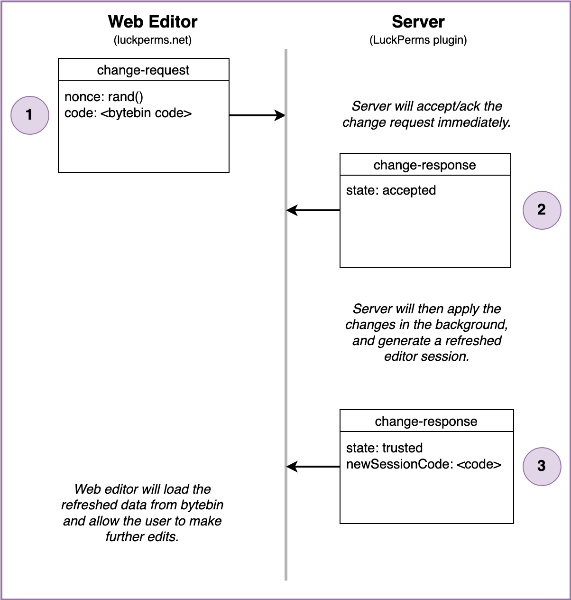

The LuckPerms Web Editor is a special application that runs in a web browser, and allows server admins to edit permissions with an easy to use interface.

User-facing documentation can be found on the [Web Editor](#Web-Editor) page. This page focuses on technical information.

## Communicating with the server
The web editor application is hosted centrally (on luckperms.net), but needs to be able to communicate with the LuckPerms plugin running on users' servers.

The application itself is stateless, but it uses two special services to exchange data with the server.

* [bytebin](https://github.com/lucko/bytebin) - used to exchange data payloads using HTTP GET/POST requests
* [bytesocks](https://github.com/lucko/bytesocks) - used to exchange "real-time" messages using WebSockets

Both the LuckPerms plugin (running on the Minecraft server) and the LuckPerms web editor (running in the browser) communicate with these "middle-man" services, and use them to exchange data/instructions with each other.


## WebSocket Protocol
Both the server and the web editor connect to a WebSocket "channel" provided by the bytesocks service (see above). They exchange secure (signed cryptographically) messages in this channel with each other.

More details about security can be found in the description of the [pull request](https://github.com/LuckPerms/LuckPerms/pull/3303) that added the functionality.

### Message (packet) format
The socket messages are in a readable JSON format.

```json
{
    "msg": "string",
    "signature": "string",
}
```

The outer message "frame" shown above contains two fields.
* The `msg` field contains the JSON encoded packet in plaintext (not encrypted)
* The `signature` field contains a SHA256withRSA signature derived from the message, encoded in base64.

### Connect

When the initial session is created (by a user running the `/lp editor` command on their server), the plugin will create a new bytesocks channel for the session and immediately join it. The id of the bytesocks channel and the plugin public key is included in the initial bytebin data payload. The bytebin payload id is included as a parameter in the URL opened by the user.

The web editor will only accept messages sent in the channel that have been signed using the plugin/server public key.

The connection flow starts when the web editor sends a `hello` message to the channel (the server should be connected & "listening" in the channel already).

The `hello` message includes:
* nonce - a short, random string to identify the session
* sessionId - the bytebin id the web editor was opened with
* browser - a short description of the os/browser being used
* publicKey - the editor's public key. This is used by the server to ensure that subsequent messages received from the editor have not been tampered with.

During the connection flow, the Minecraft server (LuckPerms plugin) will ensure that either:
* the editor public key is known from a previous session
* the user runs a command to explicitly trust the editor. This process uses the nonce to ensure they trust the right one in the case of >1 connections!

The server will return a `hello-reply` message to inform the editor of what the outcome is.

<p>
  
</p>

Once the connection has been established, the server will only accept incoming messages signed using the editor's key.

### Ping

The web editor will periodically send `ping` messages, to which the server will reply with a `pong` if it is still listening.

This serves two purposes:
* Keeps the WebSocket channel active. Some intermediary web proxies enforce a keepalive, which will timeout the socket connection if messages aren't sent for a certain period of time.
* Gives the web editor an indication of whether the server is still listening, and therefore whether it is able to use the socket to send updates.

<p>
  
</p>

The server also uses the `pong` message to inform the editor that it is disconnecting from the socket. This could be for a number of reasons:
* the Minecraft server has been stopped
* the user who created the session is no longer connected to the server
* timeouts
* unexpected errors

### Request Changes

When the user presses the "apply" button in the web editor, this flow is triggered.

The web editor will upload the changes to bytebin and obtain the payload id. It then sends the payload id to the server using the socket.

The server will apply the changes, then upload refreshed state to bytebin, and return this payload id to the web editor using the socket.

<p>
  
</p>

