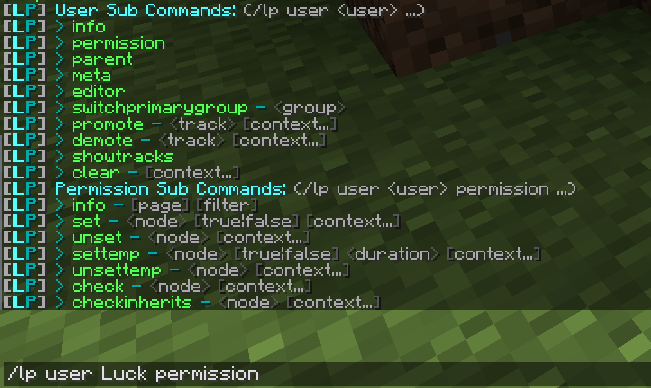
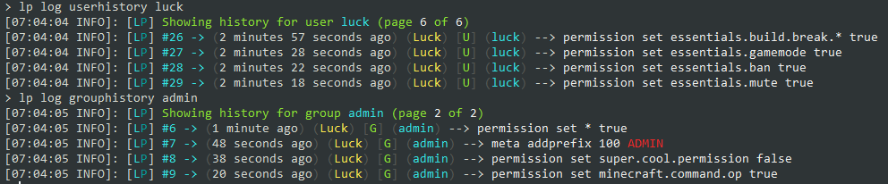

**Hi there!** 👋

Welcome to the LuckPerms project - it's good to have you!

The purpose of this page is to answer a number of questions/reactions people tend to have when they first discover the project, and explain why we think you should use LuckPerms!

Let's start with some FAQs.

___

#### Yet another permissions plugin?
Yep. We thought there was room for improvement among the plugins already out there!

LuckPerms is:

* **fast** - written with performance and scalability in mind.
* **reliable** - trusted by thousands of server admins, and the largest of server networks.
* **easy to use** - setup permissions using commands, directly in config files, or using the web editor.
* **flexible** - supports a variety of data storage options, and works on lots of different server types.
* **extensive** - a plethora of customization options and settings which can be changed to suit your server.
* **free** - available for download and usage at no cost, and permissively licensed so it can remain free forever.

#### I've been using [x] plugin for years and it works great! Why should I bother switching?
Most other permission plugins date back a number of years, and increasingly have been abandoned by their original authors, receive no updates, support or bug fixes. LuckPerms is still an active resource and we endeavour to reply to all bug reports, issues and feature requests in a timely manner.

#### LuckPerms seems pretty big/complex and I just want something simple and lightweight.
Although the plugin has lots of customisation options, the default values are fine for most users.
The LuckPerms in-game and online interfaces are very straight forward to use, and there is a vast array of information and setup guides you can read here on our wiki! 🎉

#### I run a big network and performance is important. How does LuckPerms perform?
The plugin has been written and improved over time with large servers in mind. It has proven itself to be very fast and reliable. LuckPerms currently runs on a number of popular networks in the community.

LuckPerms has been designed to make use of multithreading for almost all of its operations. Lookups for permission checks and meta data are cached, and the internal data structures are designed in order to make queries as fast/efficient as possible.

___

For the rest of this page, let's focus on some of the cool features LuckPerms has, which you may not have seen before / been aware of!

### Web Editor
As well as the in-game/console command interface, LuckPerms has a web editor which you can use to make changes to your permission data.

Anyone can use the editor, it works out of the box and doesn't require any extra setup!

It's super easy to use. You can try out a [demo session](https://luckperms.net/editor/demo) or have a look at the editor [wiki page](Web-Editor).

___

### Verbose
LuckPerms has a [verbose](Verbose) system, which allows you to monitor permission checks made by other plugins, occurring in real time.

You can trace exactly where permission checks originate from - right down to the line of code which caused the check!

Verbose recordings can be viewed in a special web app for easier analysis and reading. You can have a look at a [demo recording here](https://luckperms.net/verbose/demo).

___

### Permission trees
LuckPerms allows you [build "permission trees"](General-Commands#lp-tree-scope-player) of all permissions known to the server. The data is populated using permissions registered to the server by plugins.

The tree will grow over time as permissions checked for by plugins on the server are added.

Trees can be color coded depending on whether a certain player has each permission. This allows you to easily visualise which permissions a player has access to.

Permission trees can be viewed in a special web app for easy viewing and interpretation. You can have a look at a [demo tree here](https://luckperms.net/treeview).

___

### Command interface & tab completion
The command system is super easy to use and understand. As well as the [documentation available here on the wiki](Command-Usage), command usage and listings can also be viewed in-game.

All LuckPerms commands are fully tab completable, meaning you have to do less typing to get stuff done!

___

### Action logging
LuckPerms makes a detailed log of all changes that are made. If you have a rogue staff member try to give themselves permissions, instead of trawling through the servers log file, you can simply search for any actions executed by them!

You can also view the history of certain users, groups, or tracks, or look at the actions executed by a user.

___

### Supports multiple versions and platforms
LuckPerms was written in a way which makes it easy for us to support lots of different server types and versions.

You can always grab the latest downloads for the platforms we support on the [downloads](https://luckperms.net/download) page!
